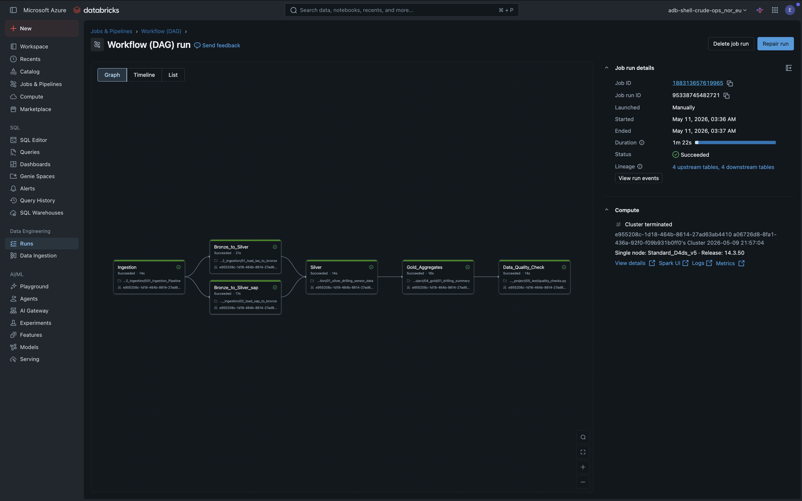
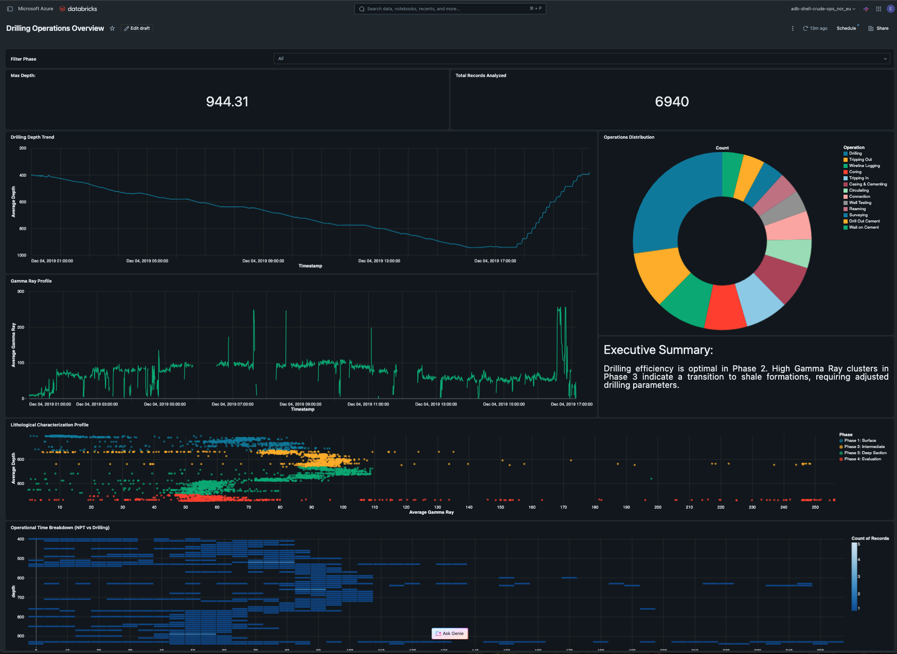

## CrudeOps: End-to-End Drilling Analytics 
###  Summary

CrudeOps is a production-grade Lakehouse solution that converts raw drilling telemetry (LAS, SAP) into actionable operational insights. It automates drilling phase detection and lithological boundary mapping to minimize Non-Productive Time (NPT).

## Architecture & Tech Stack
Built on Medallion Architecture within the Databricks Data Intelligence Platform.
Ingestion: Auto Loader (Streaming/Incremental)
Storage: Delta Lake & Unity Catalog
Compute: PySpark (SQL & Structured Streaming)
Orchestration: Databricks Workflows (DAG)
QA: Automated testing with pytest
BI: Databricks AI/BI Dashboards

Fully automated orchestration showing parallel ingestion and quality gates.
https://adb-7405614744420764.4.azuredatabricks.net/jobs/188313657619965?o=7405614744420764

##  Data Provenance
- **Publisher:** Equinor (Volve Open Dataset)
- **Source:** Databricks Marketplace / Reference Samples
- **Context:** Real-world drilling telemetry from the Volve field (North Sea), provided by Equinor to foster innovation in the energy sector.

## Key Engineering Features

#1. Incremental Ingestion (Bronze)
Auto Loader: Efficiently handles raw CSVs with Schema Evolution, preventing pipeline failures when source structures change.

Cost-Efficiency: Uses availableNow triggers for incremental processing at batch-level costs.

#2. Signal Integration (Silver)
Merged LAS sensor logs and SAP reports into a cleaned, unified Single Source of Truth.

Standardized units and filtered sensor noise for high-integrity time-series analysis.

#3. Business Logic (Gold)
Algorithmic classification of rig activity: Drilling, Connection, Tripping.

Pre-aggregated lithology and performance metrics for sub-second dashboard latency.

# Quality & Governance
Data Quality Gate: Integrated pytest suite validates physical ranges (e.g., depth) and schema integrity before publishing.

Lineage: Unity Catalog provides end-to-end visibility from raw file to final KPI.

 Business Insights

https://adb-7405614744420764.4.azuredatabricks.net/dashboardsv3/01f14cb9707514b59ff2080399c53d05/published?o=7405614744420764&f_9a18dda7%7Ephase=_all_

#Lithology Profiling: Real-time formation mapping via Gamma Ray signatures.

Operational Breakdown: Rig activity distribution to identify bottlenecks.

Progress Tracking: Live Measured Depth (MD) vs. Time analysis.
-----
Contact: shevchuk.viktor@gmail.com | Role: Principal Data Engineer / Architect